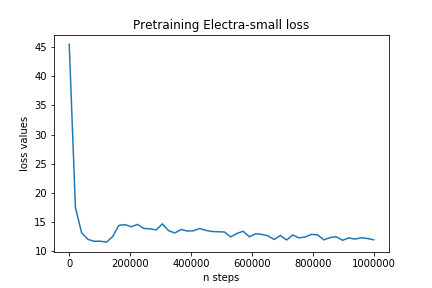

# ELECTRA for Japanese text.
This is repository of Japanese ELECTRA model.

We trained ELECTRA model based on [Google/ELECTRA](https://github.com/google-research/bert) code and follow the pipeline from [yoheikikuta](https://github.com/yoheikikuta/bert-japanese.git) to switch to use SentencePiece. Big thanks to Google team and yoheikikuta for their efforts.

In this Readme, I combined documents from Google, yoheikikuta and my explanation.
## Pretrained models
We provide pretrained Electra model and trained SentencePiece model for Japanese text.
Training data is the Japanese wikipedia corpus from [`Wikimedia Downloads`](https://dumps.wikimedia.org/).  
Please download all objects of Electra in the following google drive to `data/models/electra_small/` directory, then move the vocab file to `data/`.
- **[`Pretrained Electra model and trained SentencePiece model`](https://drive.google.com/drive/folders/1xJFW85887gCf595fklpI743UdNbS6LSZ?usp=sharing)** 

Loss function during training is as below:



## Pre-train a small ELECTRA model
These instructions pre-train a small ELECTRA model (12 layers, 256 hidden size). The pre-training task of Electra-small took 6 days with 1M steps by using 1 GPU Radeon VII 16GB.
All scripts for pretraining from scratch are provided. Follow the instructions below.
### Training SentencePiece model
Please download jawiki-data from this [link](https://dumps.wikimedia.org/jawiki/20200601/jawiki-20200601-pages-articles-multistream.xml.bz2) and extract it. It's also the dataset we used to pretrain Electra.

```
python pretrain/train-sentencepiece.py
```
- Run `python extract_wiki_data.py` to extract the dataset.
### Data preparation
- Place the vocab file and sentencepiece model in `data/wiki-ja.vocab` and `data/wiki-ja.model`. 
- Run 
```python build_japanesewiki_pretrain_data.py --data-dir data/ --model-dir data/ --num-processes 4```.  
It pre-processes/tokenizes the data and outputs examples as tfrecord files under `data/pretrain_tfrecords`.
### Pretraining
This step is exactly the same as in Google/Electra document. You can refer this script below:
```
python run_pretraining.py \
    --data-dir data \
    --model-name electra_small_japanese \
    --hparams '{"debug": false, "do_train": true, "do_eval": false, "vocab_file": "data/vocab.txt", "model_sentencepiece_path": "model_sentence_piece/wiki-ja.model", "model_size": "small", "vocab_size": 32000, "max_seq_length": 512, "num_train_steps": 1000000, "train_batch_size": 64}'
```
